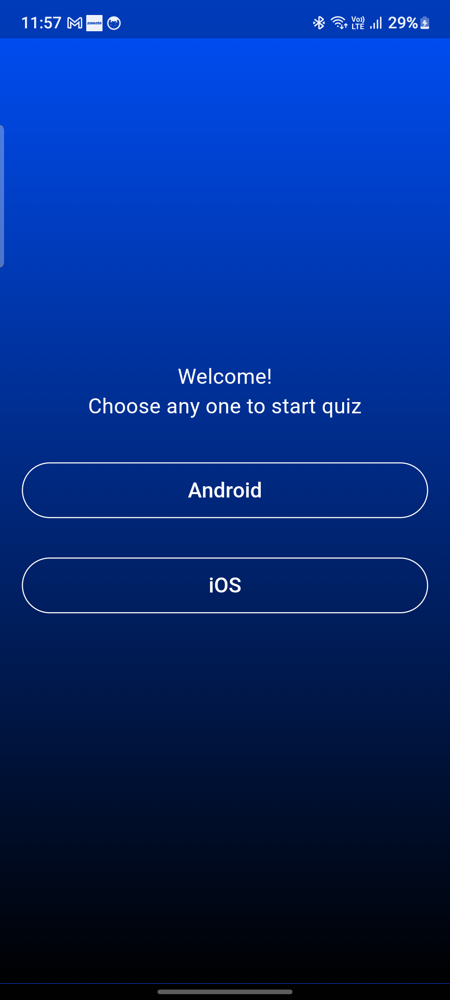
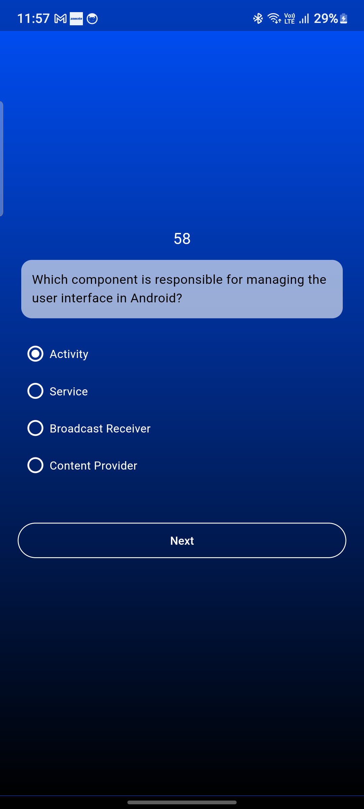

# Quiz One

A Flutter project built as a learning exercise for cross-platform development.

## Overview

**Quiz One** is a simple quiz application with three primary screens: the Welcome Screen, Quiz Screen, and Score Screen. The app allows users to select a language, framework, or platform to start a quiz, complete with a timer and multiple-choice questions.

## Screens

1. **Welcome Screen**
   - The user selects a preferred language, framework, or platform to start the quiz.

2. **Quiz Screen**
   - Displays a timer and presents 30 questions based on the user's chosen category.
   - Each question has multiple-choice options, and users can progress through the questions with the timer in mind.

3. **Score Screen**
   - After completing the quiz, users see their score, showing their performance on the quiz.

## Screenshots

Here are some screenshots of the application:

- **Welcome Screen**
  

- **Quiz Screen**
  

- **Score Screen**
  

> **Note**: Ensure screenshots are saved in the `screenshots` folder within your project directory, and update the file paths if necessary.

## Motivation

This app was created to explore Flutter's capabilities in building cross-platform applications.

## Getting Started

If you're new to Flutter, here are a few resources to help you get started:

- [Lab: Write your first Flutter app](https://docs.flutter.dev/get-started/codelab)
- [Cookbook: Useful Flutter samples](https://docs.flutter.dev/cookbook)

For more Flutter documentation, tutorials, and a full API reference, visit the [Flutter website](https://docs.flutter.dev/).

## Installation

To run this project:

1. Clone the repository
2. Navigate to the project directory
3. Run `flutter pub get` to install dependencies
4. Use `flutter run` to start the application
